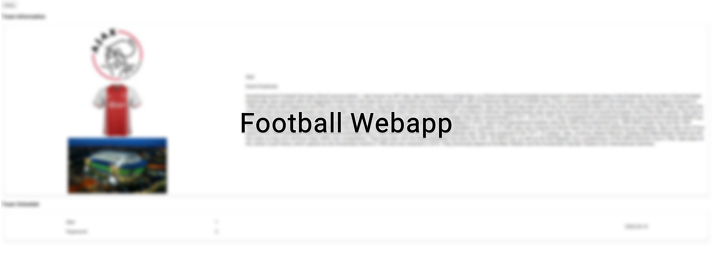
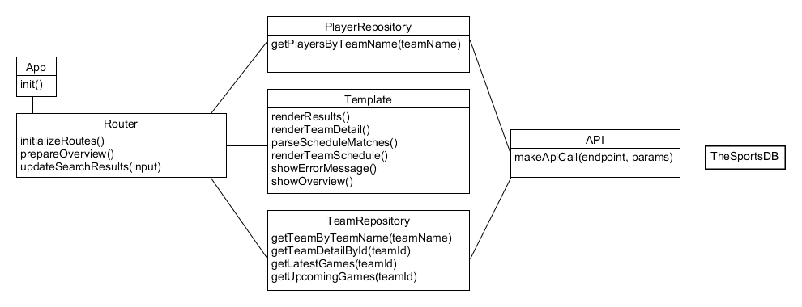
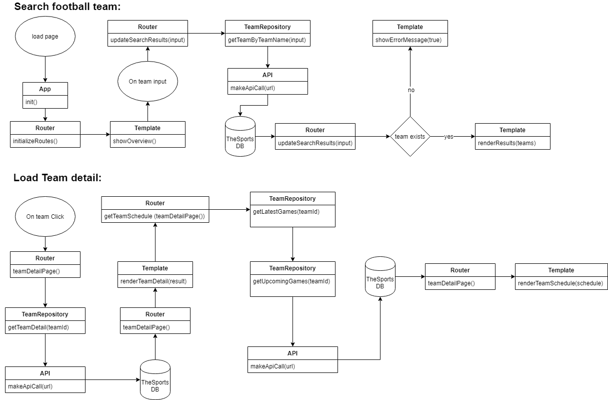

# Football WebApp

### Introduction
This is a simple one-pager web app where you can see search up football teams and find any statistics
available on them.

## Table of Contents
* [Live Demo](#Live-Demo)
* [Installation](#Installation)
* [Features](#Features)
* [API](#API)
* [Diagrams](#Diagrams)
    * [Actor Diagram](#Actor-Diagram)
    * [Interaction Diagram](#Interaction-Diagram)
* [Built with](#Built-with)
* [TODO](#TODO)
* [Feature Wishlist](#Feature-Wishlist)
* [License](#License)


## Live Demo
[Here's a link to the live demo](https://tnanhekhan.github.io/web-app-from-scratch-1920/)
## Installation
Clone this repo through the CLI or your favourite GIT client.
```
https://github.com/tnanhekhan/web-app-from-scratch-1920.git
```

Then open the index.html inside the **docs**
folder with your Text editor, IDE or browser of choice. 
## Features
* Find any professional football team!
* Find the latest played matches of any team!
* Find the upcoming matches of your team!
## API
The api this project uses is [TheSportsDB](https://www.thesportsdb.com/). This API is 
an open, crowd-sourced database of sports artwork and metadata. This API has no request limits.
Here's an example of a result from the endpoint  ```lookupteam.php?``` with the url parameter ```id=1333604```:
```json
{
    "teams": [
        {
            "idTeam": "133604",
            "strTeam": "Arsenal",
            "strTeamShort": "Ars",
            "strAlternate": "Gunners",
            "intFormedYear": "1892",
            "strSport": "Soccer",
            "strLeague": "English Premier League",
            "strStadium": "Emirates Stadium",
        }
    ]
}
```
## Diagrams
### Actor Diagram

### Interaction Diagram


## Built with
[Transparency](https://github.com/leonidas/transparency): Client-side templating engine  
[Routie](http://projects.jga.me/routie/) Javascript hash routing library

## TODO
- [x] Add Poster in Introduction
## Feature Wishlist
- [x] Show Team Detail Page
- [ ] Show Player Detail Page
- [ ] Show Game Detail Page
## License
[MIT License](https://opensource.org/licenses/MIT)
